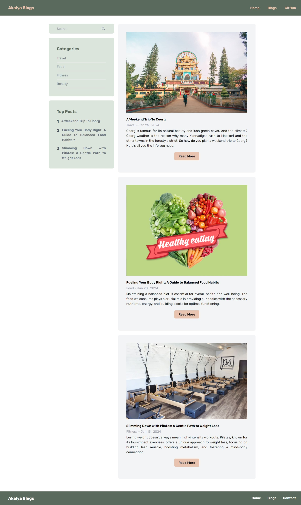
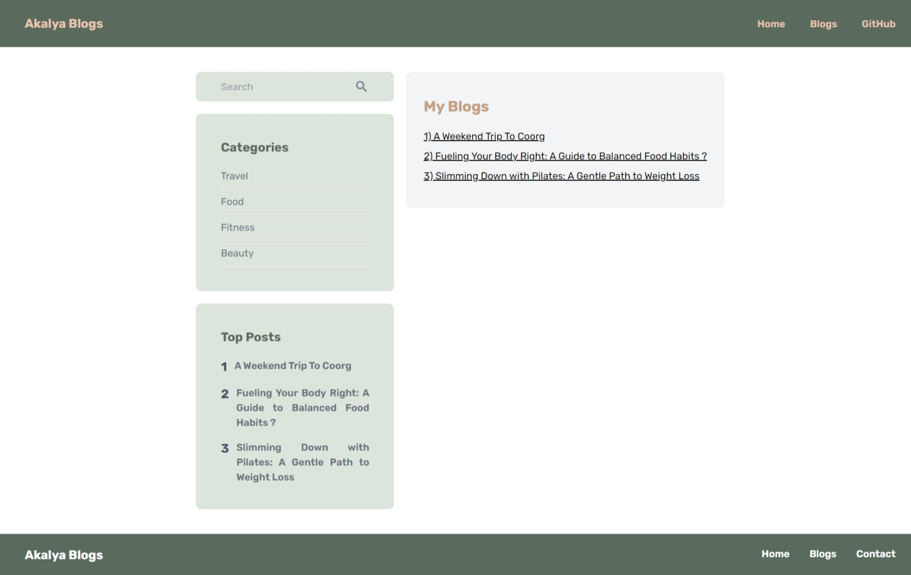
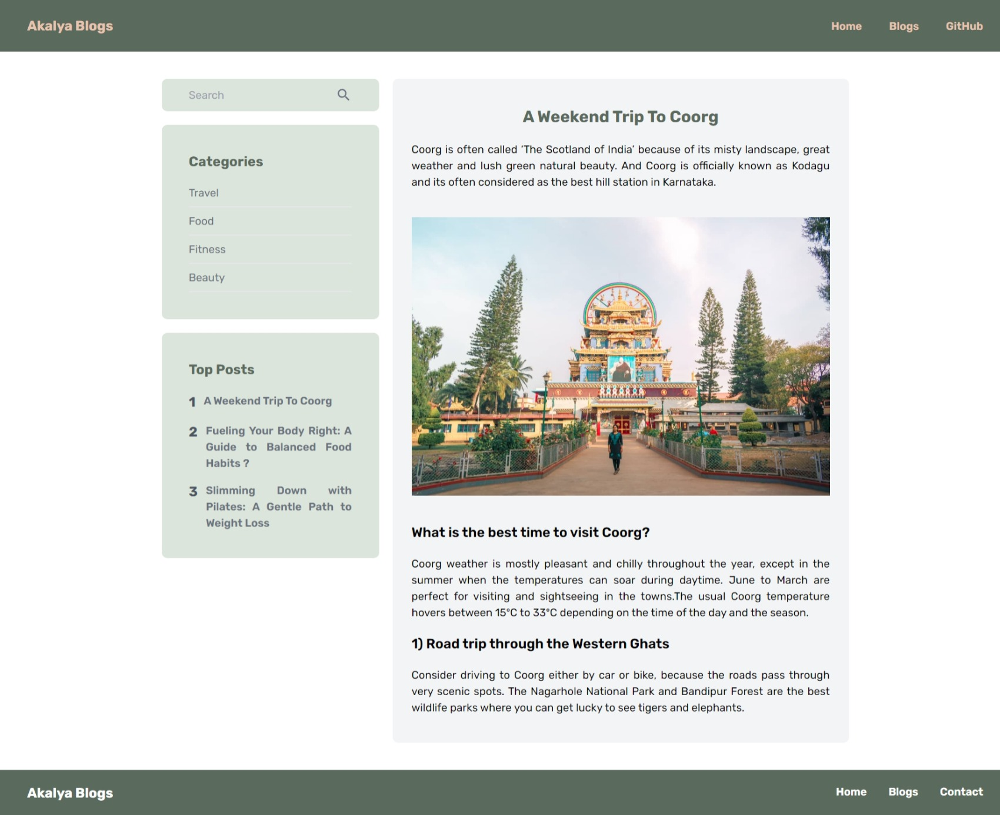
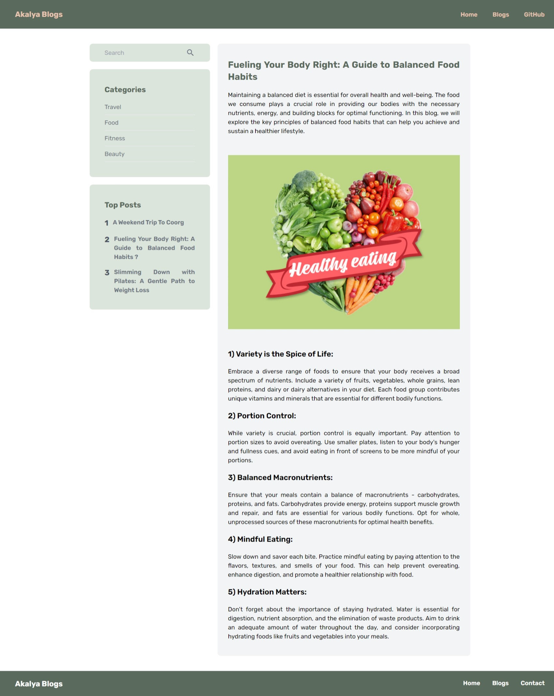
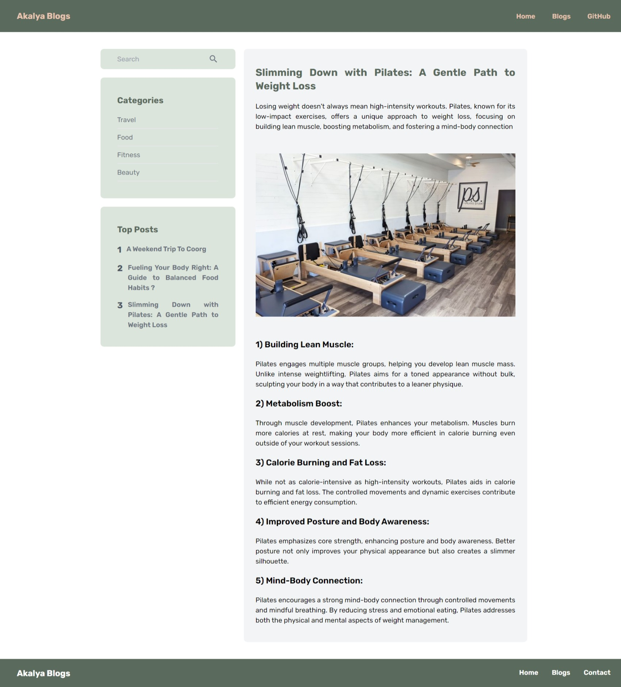

# # Akalya Blogs By Muthu Akalya 

Cyberdude Networks Pvt. Ltd Internship Project # 14 - **Akalya Blogs**.

## Table of Contents
- [Akalya Blogs by Muthu Akalya 🚀](#Akalya-Blogs-by-Muthu-Akalya)
  - [Table of Contents](#table-of-contents)
  - [Description](#description)
  - [Demo](#demo)
  - [Internship](#internship)
  - [Technologies Used](#technologies-used)
  - [Features](#features)
  - [Getting Started](#getting-started)
  - [Contributing](#contributing)
  - [License](#license)

## Description

This project (Akalya Blogs) was assigned by Cyberdude Networks Pvt Ltd while I'm working as an Full Stack Engineer Inten. It is a React-based web application aimed at providing a platform for users to read and explore various blog posts categorized into travel, food, fitness, and beauty topics. It utilizes React Router DOM for navigation between different sections of the application. Check it out below **Live Link** below for your convenience. 
## Demo

✨**Live Link is Here**:https://akalya-blog-01-react-js.netlify.app/
<br>
<br>












## Internship

This internship is provided by [CyberDude Networks Pvt. Ltd.](https://youtube.com/cyberdudenetworks) as part of the 6-Month Free Internship program, a skill development initiative organized to enhance participants' skills. Mentoring was provided by [Mr. Anbuselvan Rocky](https://instagram.com/anbuselvanrocky). For more information, [you can contact CyberDude Networks here](https://cyberdudenetworks.com).

## Technologies Used

HTML 5 | Tailwind CSS | Vite | React | React-router 

## Features

- **Blog Categories**: Explore blog posts categorized into travel, food, fitness, and beauty.
- **Responsive Design**: The application is designed to be responsive, providing a seamless experience across different devices.
- **React Router DOM**: Utilizes React Router DOM for navigation, allowing users to easily move between different sections of the application.

## Getting Started
To get started with Akalya Blogs on your local machine, follow these steps:

1) Clone the Repository: Clone this repository to your local machine using:

```
git clone https://github.com/your-username/akalya-blogs.git
```

2) Install Dependencies: Navigate into the cloned repository and install the necessary dependencies using npm or yarn:


```
cd akalya-blogs
npm install
# or
yarn install
```

3) Run the Application: Once the dependencies are installed, you can start the development server by running:


```
Copy code
npm start
# or
yarn start
```

4) View the Application: The application should now be running locally. Open your web browser and navigate to http://localhost:3000 to view Akalya Blogs.


## Contributing

Contributions to Akalya Blogs are welcome! If you'd like to contribute to the project, feel free to open a pull request. Before submitting a pull request, please ensure that your changes align with the project's coding style and conventions. 

## License

MIT

## Acknowledgments

[Mr.AnbuSelvan Rocky](https://github.com/anburocky3)


---


     