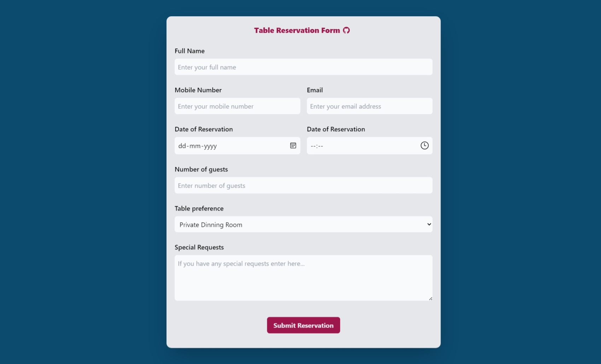
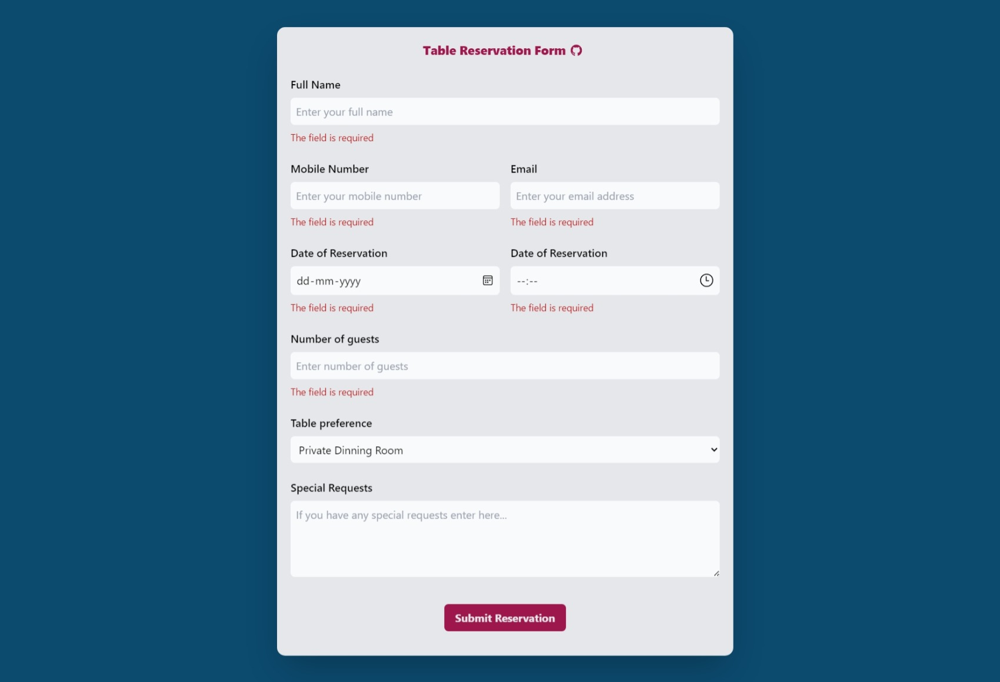
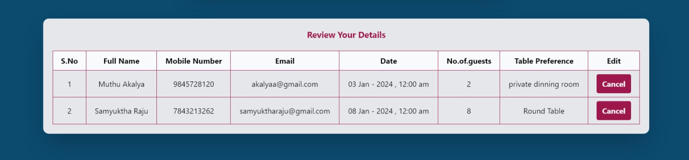

# Table Reservation Form By Muthu Akalya 

Cyberdude Networks Pvt. Ltd Internship Project # 7 - **Table Reservation Form**.

## Table of Contents
- [Table Reservation Form By Muthu Akalya](#table-Reservation-form-by-Muthu-Akalya)
  - [Table of Contents](#table-of-contents)
  - [Description](#description)
  - [Demo](#demo)
  - [Internship](#internship)
  - [Technologies Used](#technologies-used)
  - [Features](#features)
  - [Contributing](#contributing)
  - [License](#license)

## Description

 This is a simple web application for table reservations built using HTML, Tailwind CSS, JavaScript, and DOM manipulation. The application allows users to reserve tables, view existing reservations, update reservation details, and delete reservations. The application utilizes local storage to store reservation data persistently.This project (Instagram UI challenge) assigned by Cyberdude Networks Pvt Ltd while I'm working as an Full Stack Engineer Intern.


## Demo

1) Copy the following link and paste it on a browser.

✨**Live Link is Here**:
```
 https://muthuakalya.github.io/cyberdude-challenges/javascript%20-%20DOM/02)Table%20Reservation%20Form/dist/ 
```
<br>
<br>








## Internship

This internship is provided by [CyberDude Networks Pvt. Ltd.](https://youtube.com/cyberdudenetworks) as part of the 6-Month Free Internship program, a skill development initiative organized to enhance participants' skills. Mentoring was provided by [Mr. Anbuselvan Rocky](https://instagram.com/anbuselvanrocky). For more information, [you can contact CyberDude Networks here](https://cyberdudenetworks.com).

# Technologies Used

**HTML**: Used for structuring the web pages and forms.
**Tailwind CSS**: Utilized for styling the user interface.
**JavaScript**: Used for implementing CRUD functionalities and DOM manipulation.
**Local Storage**: Utilized to store reservation data persistently in the browser.

## Features

- Create Reservation: Users can fill out a form to reserve a table specifying their name, number of guests, date, and time.
- Read Reservation: The application displays existing reservations in a table format, showing details such as reservation ID, name, number of guests, date, and time.
- Update Reservation: Users can edit existing reservations to update details such as name, number of guests, date, and time.
- Delete Reservation: Users can delete existing reservations.
- Local Storage: Reservation data is stored locally in the browser's storage, ensuring persistence even after page reloads. 


## Usage
- To make a reservation, fill out the reservation form with your details and click "Reserve Table".
- To view existing reservations, scroll down to the reservation table.
- To delete a reservation, click the "Cancel" button next to the reservation you want to remove.

## Contributing

Feel free to contribute to this project by "Forking" this repo, and Add a PR for any additional features that can be added this UI Challenge. 

## License

MIT

## Acknowledgments

I would like to thank [Mr.Shajid Shafee](https://github.com/mshajid) for helping me to deploy this project into github pages.

<!-- | Resources | Links |
|--|--|
| Color Pallet | colorhunt.co | --> 


---


  
