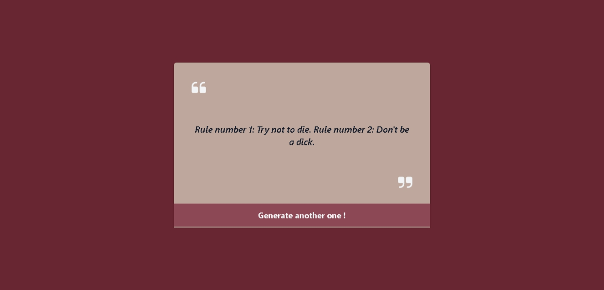
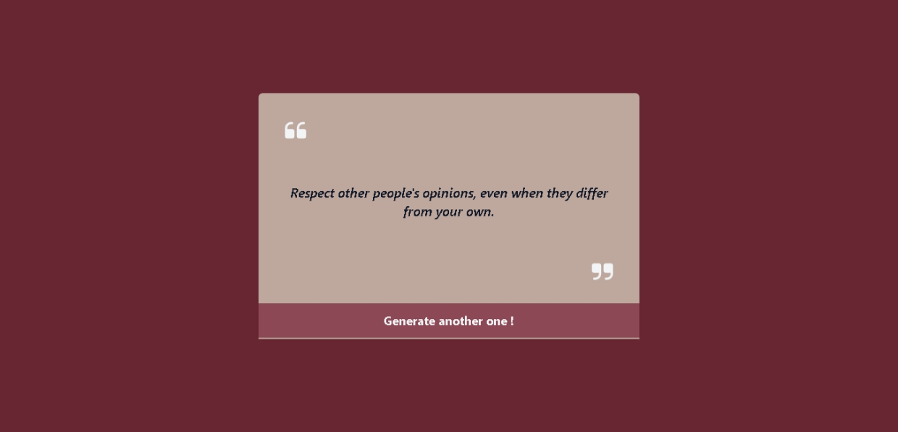

# Table Reservation Form By Muthu Akalya

Cyberdude Networks Pvt. Ltd Internship Project # 12 - **Advise Generator**.

## Table of Contents

- [Advise Generator By Muthu Akalya](#advise-generator-by-Muthu-Akalya)
  - [Table of Contents](#table-of-contents)
  - [Description](#description)
  - [Demo](#demo)
  - [Internship](#internship)
  - [Technologies Used](#technologies-used)
  - [Features Added](#features-added)
  - [Contributing](#contributing)
  - [License](#license)

## Description

Random Advice Generator is a web application that provides users with random pieces of advice upon clicking the "Another" button. The project utilizes a [DevRes API](https://api.adviceslip.com/advice) to fetch advice content and is built using HTML, styled with Tailwind CSS, and enhanced with JavaScript for dynamic functionality.

## Demo

1. Copy the following link and paste it on a browser.

✨**Live Link is Here**:

```
https://muthuakalya.github.io/cyberdude-challenges/javascript%20-%20DOM/07)%20Advise%20Generator/dist/

```

<br>
<br>





!

## Internship

This internship is provided by [CyberDude Networks Pvt. Ltd.](https://youtube.com/cyberdudenetworks) as part of the 6-Month Free Internship program, a skill development initiative organized to enhance participants' skills. Mentoring was provided by [Mr. Anbuselvan Rocky](https://instagram.com/anbuselvanrocky). For more information, [you can contact CyberDude Networks here](https://cyberdudenetworks.com).

## Technologies Used

- HTML
- TailwindCSS
- JavaScript

## Features Added

- Generate random advice by clicking the "Another" button
- User-friendly and responsive design
- Simple and intuitive interface

## Contributing

Feel free to contribute to this project by "Forking" this repo, and Add a PR for any additional features that can be added this UI Challenge.

## License

MIT

## Acknowledgments

I want to express my gratitude to [Mr. Anbuselvan Rocky](https://github.com/anburocky3) for the invaluable guidance and support throughout the development of this project. Their insights and feedback have significantly contributed to the success of this endeavor. Special thanks to all my Colleague for their collaborative efforts and constructive suggestions.

As I continue to advance in my programming journey, the skills acquired and lessons learned from this project will serve as a solid foundation for future endeavors.

---

  
